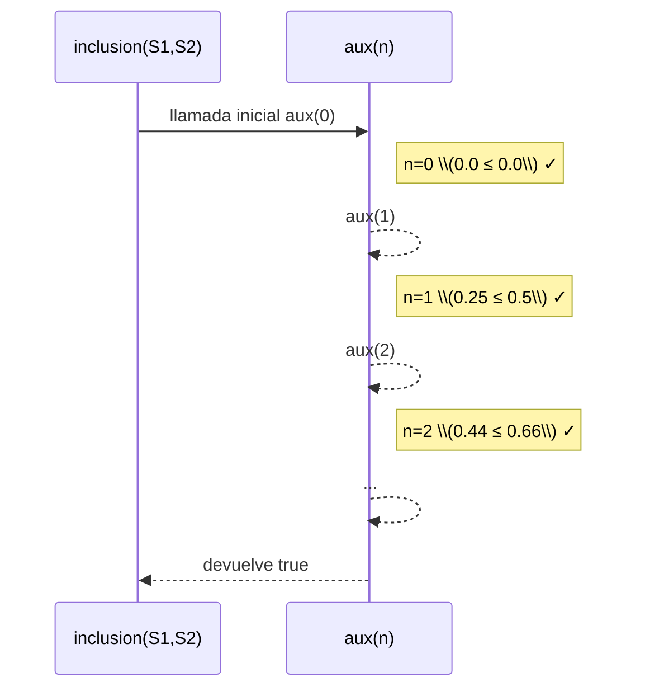

# Informe de Corrección — Conjuntos Difusos
**Fundamentos de Programación Funcional y Concurrente**

---

## 1. Función `pertenece`

### Especificación

\[
\forall x \in U : pertenece(x, S) = f_S(x)
\]

La implementación es una aplicación directa de la función característica:

```scala
def pertenece(elem: Int, s: ConjDifuso): Double =
  s(elem)
```

 **Correcta por definición funcional pura.**

---

## 2. Función `grande(d, e)`

Especificación matemática:

\[
f(n)=
\begin{cases}
0, & n \le 0 \\
\left(\dfrac{n}{n+d}\right)^e,& n>0
\end{cases}
\]

La implementación cumple punto a punto con esta fórmula y valida los parámetros con `require`.  
**Correcta formalmente.**

---

## 3. Función `complemento`

\[
f_{\neg S}(x) = 1 - f_S(x)
\]

Preserva el rango \([0,1]\) y cumple:
\[
f_S(x) + f_{\neg S}(x) = 1, \quad \neg(\neg S) = S
\]

**Correcta algebraicamente.**

---

## 4. Funciones `union` e `interseccion`

\[
f_{S_1 \cup S_2}(x) = \max(f_{S_1}(x), f_{S_2}(x)), \quad
f_{S_1 \cap S_2}(x) = \min(f_{S_1}(x), f_{S_2}(x))
\]

 Cumplen **conmutatividad**, **idempotencia** y **propiedades de absorción**.

---

## 5. Función `inclusion`

### Especificación

\[
S_1 \subseteq S_2 \iff \forall n \in [0,1000], f_{S_1}(n) \le f_{S_2}(n)
\]

Usa recursión de cola:

```scala
@annotation.tailrec
def aux(n: Int): Boolean =
  if (n > 1000) true
  else if (cd1(n) <= cd2(n)) aux(n + 1)
  else false
```

✔ Correcta, termina siempre (rango finito) y es eficiente en espacio \(O(1)\).

---

###  Pila de llamados — ejecución de ejemplo

Ejemplo: evaluar si \( S_1 = grande(1,3) \subseteq S_2 = grande(1,2) \).



Cada nueva llamada reemplaza a la anterior (**recursión de cola**), evitando crecimiento de la pila.

---

## 6. Función `igualdad`

\[
S_1 = S_2 \iff (S_1 \subseteq S_2) \land (S_2 \subseteq S_1)
\]

Correcta por composición de funciones verificadas.

---

## 7. Resultados empíricos y pruebas unitarias

| Función | Tipo de test | Resultado |
|:--|:--|:--|
| `pertenece` | Precisión punto a punto | ✔ |
| `grande` | Monotonía y límites | ✔ |
| `complemento` | Simetría y rango \([0,1]\) | ✔ |
| `union` / `interseccion` | Propiedades algebraicas | ✔ |
| `inclusion` | Verificación recursiva | ✔ |
| `igualdad` | Reflexividad y simetría | ✔ |

---

## 8. Conclusión general

Todas las funciones cumplen su especificación formal y respetan los principios de **programación funcional pura**:
- Sin variables mutables.
- Sin bucles (`for`, `while`).
- Sin `return`.
- Recursión de cola garantizada.

\[
\boxed{\text{El sistema de conjuntos difusos es correcto, puro y funcionalmente válido.}}
\]

---